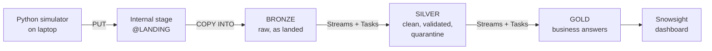

# Fleet Analytics on Snowflake

A portfolio data engineering project that simulates a fleet management and fleet financing company on Snowflake.
It answers three business questions for a portfolio of commercial fleets:

1. **Maintenance priority**: which vehicles need maintenance first?
2. **Financing opportunities**: which vehicles are candidates for a purchase leaseback or a lease restructuring?
3. **Replacement timing**: are vehicles being replaced at the right time?

> **All data is synthetic.** It is generated by a Python simulator in this repository.
> No company, vehicle, person or transaction in it is real.

---

## Contents

- [Architecture](#architecture)
- [Project status](#project-status)
- [Prerequisites](#prerequisites)
- [Installation](#installation)
  - [Step 1. Clone the repository](#step-1-clone-the-repository)
  - [Step 2. Create the Python environment](#step-2-create-the-python-environment)
  - [Step 3. Set up Snowflake with cost guardrails](#step-3-set-up-snowflake-with-cost-guardrails)
  - [Step 4. Create a key pair for Python](#step-4-create-a-key-pair-for-python)
  - [Step 5. Configure the connection](#step-5-configure-the-connection)
  - [Step 6. Generate two years of history](#step-6-generate-two-years-of-history)
  - [Step 7. Load the Bronze layer](#step-7-load-the-bronze-layer)
  - [Step 8. Verify in Snowsight](#step-8-verify-in-snowsight)
- [Costs and guardrails](#costs-and-guardrails)
- [Project structure](#project-structure)
- [Troubleshooting](#troubleshooting)

---

## Architecture



| Layer | What it holds |
|---|---|
| **Stage** | Files uploaded from the laptop, one folder per table |
| **Bronze** | Exactly what arrived, bad rows included. Every row records its source file, row number and load time |
| **Silver** | Typed, deduplicated and validated data. Rows that fail a check go to a quarantine table with a reason |
| **Gold** | Maintenance priority, financing candidates and replacement timing |

**Data model:** clients, vehicles, lease contracts, telematics events (nested JSON), fuel transactions, maintenance events, resale values and a diagnostic trouble code reference.

**Deliberate data quality problems** that Silver must catch: duplicate fuel transactions, missing telematics pings, odometers that go backward, inconsistent category spellings and orphan rows.
Every injected problem is logged in an answer key, so Silver's results can be checked exactly.

---

## Project status

| Stage | Status |
|---|---|
| Snowflake setup with cost guardrails | ✅ Done |
| Backfill generator, two years of history | ✅ Done |
| Bronze layer and loader | ✅ Done |
| Live telematics stream | ⏳ Next |
| Silver layer: data quality, quarantine, FLATTEN, Streams and Tasks | ⏳ Planned |
| Gold layer: the three business questions | ⏳ Planned |
| Snowsight dashboard and findings | ⏳ Planned |

---

## Prerequisites

| You need | Notes |
|---|---|
| **Python 3.9 or newer** | Check with `python --version` |
| **Git** | On Windows, Git for Windows also provides **Git Bash** and **OpenSSL**, which Step 4 uses |
| **A Snowflake account** | A free 30-day trial works. You need the `ACCOUNTADMIN` role, which trial users have |
| **About 50 MB of disk** | For the generated files |

No other tools are needed. Everything in Snowflake is done in **Snowsight**, the Snowflake web interface.

---

## Installation

Work through the steps in order. Each step ends with a check, so you know it worked before moving on.

### Step 1. Clone the repository

```bash
git clone https://github.com/<your-username>/fleet-project.git
cd fleet-project
```

✔ **Check:** the folder contains `CLAUDE.md`, `generator/`, `sql/` and `requirements.txt`.

### Step 2. Create the Python environment

1. Create a virtual environment in the project folder:
   ```bash
   python -m venv .venv
   ```
2. Activate it:
   - **Windows (Command Prompt or PowerShell):** `.venv\Scripts\activate`
   - **Windows (Git Bash):** `source .venv/Scripts/activate`
   - **macOS or Linux:** `source .venv/bin/activate`
3. Install the libraries:
   ```bash
   pip install -r requirements.txt
   ```

✔ **Check:** your prompt starts with `(.venv)`, and `pip list` shows `Faker` and `snowflake-connector-python`.

> Activate the environment again every time you open a new terminal.

### Step 3. Set up Snowflake with cost guardrails

This step creates the credit cap, the working role, the warehouse, the database and the landing stage.
It is metadata work only and costs almost nothing.

1. Sign in to **Snowsight**.
2. Go to **Projects → Worksheets** and create a new **SQL worksheet**.
3. Paste in the whole of [`sql/01_setup.sql`](sql/01_setup.sql).
4. Click the arrow next to **Run** and choose **Run All**, or press **Ctrl+Shift+Enter** (**Cmd+Shift+Enter** on Mac).
   > The plain **Run** button runs only the statement under your cursor.
5. Scroll through the results at the bottom and compare them with this table:

   | Object | Expected |
   |---|---|
   | Resource monitor `FLEET_RM` | credit quota 40, frequency NEVER, level ACCOUNT |
   | Warehouse `FLEET_WH` | size X-Small, auto suspend 60, state SUSPENDED |
   | Database `FLEET_DB` | schemas `BRONZE`, `SILVER`, `GOLD` |
   | Stage | `FLEET_DB.BRONZE.LANDING` |

6. **Turn on email alerts** so the credit warnings reach you:
   - Click your name at the bottom left, then **Settings → Notifications**.
   - Enable email notifications for resource monitors. Your email address must be verified first.
7. **Set up a budget** for costs the resource monitor cannot stop, such as serverless features:
   - Go to **Admin → Cost Management → Budgets**.
   - Set up the account budget with a spending limit and your email address.

✔ **Check:** in the role picker at the top right of a worksheet, you can now choose `FLEET_ENGINEER`.

> The script is safe to run again. It never resets the credit cap.

### Step 4. Create a key pair for Python

Python connects to Snowflake with a **key pair** instead of a password: no password is stored and there is no multi-factor prompt.
The private key stays on your computer. Only the public key goes to Snowflake.

> ⚠️ Never share the private key file (`.p8`). Don't paste it into Snowflake, chat, email or GitHub.

1. Open **Git Bash** (Windows) or a terminal (macOS or Linux).
2. Create a private folder for keys in your home directory, outside the project:
   ```bash
   mkdir -p ~/.snowflake
   ```
3. Generate the private key:
   ```bash
   openssl genrsa 2048 | openssl pkcs8 -topk8 -inform PEM -out ~/.snowflake/fleet_rsa_key.p8 -nocrypt
   ```
4. Derive the public key from it:
   ```bash
   openssl rsa -in ~/.snowflake/fleet_rsa_key.p8 -pubout -out ~/.snowflake/fleet_rsa_key.pub
   ```
5. Print the public key as a single line, ready to paste:
   ```bash
   grep -v "PUBLIC KEY" ~/.snowflake/fleet_rsa_key.pub | tr -d '\n'; echo
   ```
6. In a Snowsight worksheet, paste that line where shown, then choose **Run All**:
   ```sql
   USE ROLE ACCOUNTADMIN;

   SET me = '"' || CURRENT_USER() || '"';
   ALTER USER IDENTIFIER($me) SET RSA_PUBLIC_KEY = '<paste the single line here>';

   DESC USER IDENTIFIER($me);
   SELECT "property", "value"
   FROM TABLE(RESULT_SCAN(LAST_QUERY_ID()))
   WHERE "property" LIKE 'RSA_PUBLIC_KEY%';
   ```

✔ **Check:** `RSA_PUBLIC_KEY_FP` has a value starting with `SHA256:`.

### Step 5. Configure the connection

1. Find your user name and account identifier. Run this in Snowsight:
   ```sql
   SELECT CURRENT_USER() AS user_name,
          CURRENT_ORGANIZATION_NAME() || '-' || CURRENT_ACCOUNT_NAME() AS account_identifier;
   ```
2. Copy the template to create your own settings file:
   - **Windows:** `copy .env.example .env`
   - **macOS or Linux:** `cp .env.example .env`
3. Open `.env` and fill in three values:

   | Setting | Value |
   |---|---|
   | `SNOWFLAKE_ACCOUNT` | the account identifier from item 1 |
   | `SNOWFLAKE_USER` | the user name from item 1 |
   | `SNOWFLAKE_PRIVATE_KEY_FILE` | full path to the `.p8` file, with forward slashes, for example `C:/Users/you/.snowflake/fleet_rsa_key.p8` |

   Leave the role, warehouse, database and schema as they are.
4. Test the connection. This check does not start a warehouse, so it costs nothing:
   ```bash
   python generator/snowflake_conn.py
   ```

✔ **Check:** you see `Connected to Snowflake` with role `FLEET_ENGINEER` and warehouse `FLEET_WH`.

> `.env` is listed in `.gitignore` and is never committed.

### Step 6. Generate two years of history

```bash
python generator/backfill.py
```

This runs on your computer only, takes under a minute and uses no Snowflake credits.
It writes one folder per table to `data/backfill/` and prints a summary like this:

```
table                         rows
clients                          5
vehicles                       201
lease_contracts                 89
maintenance_events           1,248
fuel_transactions           25,522
telematics readings        640,753
```

✔ **Check:** `data/backfill/` contains folders such as `vehicles/` and `telematics_events/`, plus `_dq_manifest.csv`.

**Options**

| Option | Default | Effect |
|---|---|---|
| `--seed` | `42` | Same seed, same files, byte for byte |
| `--start` | `2024-10-01` | First day of history |
| `--end` | `2026-09-30` | Day after the last day of history |

> Each run deletes and rebuilds `data/backfill/`. Files starting with `_` are for checking only and are never uploaded.

### Step 7. Load the Bronze layer

```bash
python generator/load_bronze.py
```

This uploads the files to the landing stage, creates the raw tables, loads them and suspends the warehouse.
It takes about 20 seconds of warehouse time, a few cents.

✔ **Check:** every `COPY` line shows `0 errors`, and the Bronze row counts match the summary from Step 6.

> Running it again is safe. Files already uploaded or loaded are skipped, so the second run loads nothing.

### Step 8. Verify in Snowsight

Open a worksheet, choose role `FLEET_ENGINEER` and warehouse `FLEET_WH`, then run:

```sql
USE SCHEMA FLEET_DB.BRONZE;

-- The dirty category spellings, exactly as they arrived
SELECT vehicle_type, COUNT(*) FROM VEHICLES GROUP BY 1 ORDER BY 1;

-- Nested telematics: one daily batch becomes hourly readings
SELECT record:vehicle_id::string          AS vehicle_id,
       r.value:event_ts::timestamp_ntz    AS event_ts,
       r.value:odometer_km::float         AS odometer_km,
       r.value:dtc_codes                  AS dtc_codes
FROM TELEMATICS_EVENTS,
     LATERAL FLATTEN(input => record:readings) r
LIMIT 20;
```

✔ **Check:** the first query shows several spellings of each vehicle type, and the second shows hourly readings.

---

## Costs and guardrails

The project is designed to run inside a free trial's credit balance.

| Guardrail | Setting |
|---|---|
| Warehouse size | X-Small, one credit per hour while running |
| Auto-suspend | After 60 seconds idle |
| Statement timeout | 15 minutes |
| Resource monitor | 40 credits in total, never resets. Warns at 50% and 75%, suspends at 90%, stops everything at 100% |
| Working role | `FLEET_ENGINEER` cannot resize the warehouse or run serverless tasks |
| Loader | Suspends the warehouse as soon as it finishes |

**Emergency stop.** If spending looks wrong, run this in Snowsight:

```sql
ALTER WAREHOUSE FLEET_WH SUSPEND;
```

---

## Project structure

```
fleet-project/
├── generator/
│   ├── backfill.py           # simulates two years of fleet history
│   ├── snowflake_conn.py     # shared connection; run it to test the connection
│   ├── load_bronze.py        # uploads files and loads Bronze
│   └── stream.py             # live telematics stream (planned)
├── sql/
│   ├── 01_setup.sql          # credit cap, role, warehouse, database, stage
│   ├── 02_bronze.sql         # file formats, raw tables, COPY INTO
│   ├── 03_silver.sql         # data quality, quarantine, streams and tasks (planned)
│   └── 04_gold.sql           # the three business questions (planned)
├── data/                     # generated files, not committed
├── .env.example              # template for your connection settings
├── requirements.txt
├── CLAUDE.md                 # full project brief and design decisions
└── README.md
```

---

## Troubleshooting

| Symptom | Cause and fix |
|---|---|
| `RSA_PUBLIC_KEY_FP` stays empty | The key statement didn't run. Use **Run All**, not **Run**, then check the result of the key statement |
| `Invalid RSA public key` | The pasted key is broken. Rerun the command in Step 4, item 5, and paste its output with no spaces or line breaks |
| `Insufficient privileges` | The worksheet isn't using `ACCOUNTADMIN`. Change the role at the top right |
| `openssl: command not found` | On Windows, run the commands in **Git Bash**, not Command Prompt |
| `No .env file found` | Complete Step 5, item 2 |
| `Private key not found` | The path in `.env` is wrong. Use forward slashes and the full path |
| `JWT token is invalid` | The public key in Snowflake doesn't match your private key, or the account identifier is wrong. Repeat Step 4, item 6, and check Step 5, item 1 |
| `ModuleNotFoundError` | The virtual environment isn't active. See Step 2, item 2 |
| Warehouse suspended and won't resume | The 40-credit cap was reached. Check usage in **Admin → Cost Management** before raising the quota |

---

*Portfolio project with simulated data. Built with Snowflake, Python and SQL.*
